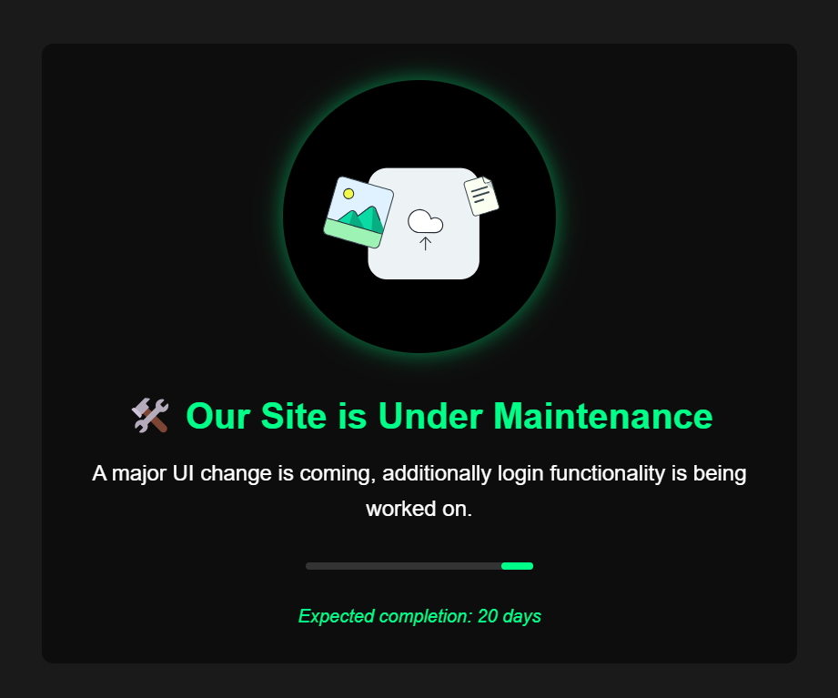

# 🚧 Website Under Maintenance Page  

This project provides a simple yet elegant **"Under Maintenance"** page that can be used to notify visitors about ongoing updates or improvements to a website.  

## ✨ Features  

- **Modern Dark UI** with a glowing effect  
- **Maintenance Message** with an expected completion time  
- **Progress Indicator** to show update status  
- **Customizable Text & Icons**  
- **Responsive Design** for mobile and desktop users  

## 🔧 How to Use  

1. Replace your website’s current `index.html` with the provided maintenance page code.  
2. Customize the text, progress bar, and estimated completion time in the HTML.  
3. (Optional) Modify the styles in `style.css` for a personalized look.  

## 📌 Notes  

- The "TaskNext" text is just a placeholder—replace it with your actual website name.  
- The UI can be further improved by adjusting animations, fonts, or additional features.  

## 🎨 Preview  

